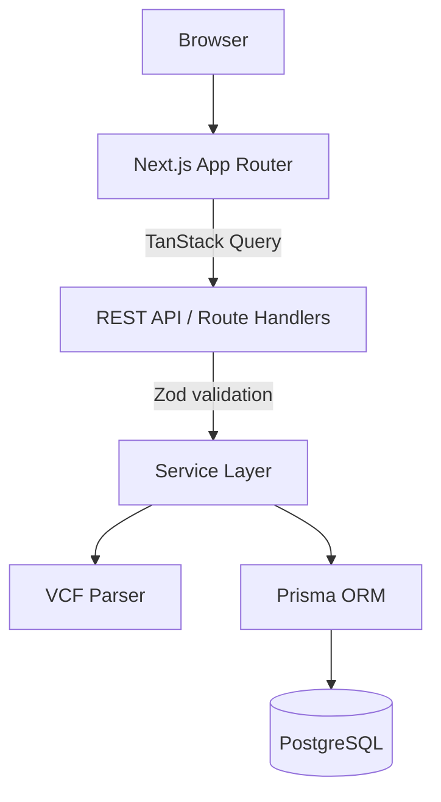
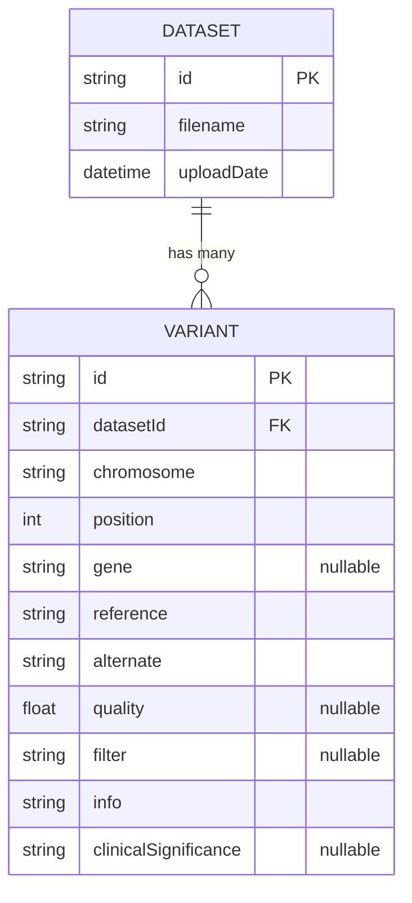

# Genome Variant Explorer

An internal genomics platform for uploading, parsing, searching, and exploring
genomic variant data from [VCF](https://samtools.github.io/hts-specs/VCFv4.2.pdf)
files. Researchers upload a VCF, the server stream-parses it into structured
variant records, and the data becomes searchable through a fast, filterable
dashboard.

> Built as a production-quality reference application: clean architecture,
> a thin API layer over a well-factored service layer, streaming file parsing,
> and a minimal, responsive UI.

---

## Project overview

| Concern      | Choice                                                        |
| ------------ | ------------------------------------------------------------- |
| Framework    | Next.js 15 (App Router), React 19, TypeScript                 |
| Styling / UI | Tailwind CSS + shadcn/ui primitives, lucide-react icons       |
| Server state | TanStack Query                                                |
| Forms        | React Hook Form (upload) + native controlled inputs (filters) |
| API          | Next.js Route Handlers (Node runtime)                         |
| Validation   | Zod                                                           |
| Database     | PostgreSQL via Prisma ORM                                     |
| Parsing      | Custom streaming VCF parser (Web Streams)                     |
| Toasts       | Sonner                                                        |

### Features

- **Dashboard** — total files, total variants, top genes, classification
  breakdown, and recent uploads, rendered as rounded metric cards.
- **Upload** — drag-and-drop VCF upload with real progress, client + server
  validation, immediate parsing, and redirect to the new dataset.
- **Variants** — paginated, sortable, searchable table with chromosome, gene,
  and clinical-significance filters.
- **Variant details** — full record view with a formatted INFO field.
- **Dataset page** — filename, upload date, variant count, and per-dataset
  statistics.

---

## Architecture

```
Browser
  │
  ▼
Next.js App Router (React Server + Client Components)
  │   TanStack Query
  ▼
REST API  (app/api/**/route.ts)
  │   Zod validation
  ▼
Service layer  (server/services/**)
  │
  ├── VCF Parser  (server/vcf/parser.ts, streaming)
  │
  ▼
Prisma ORM
  │
  ▼
PostgreSQL
```



The API layer is intentionally thin: route handlers validate input with Zod and
delegate all business logic to the service layer, which is the only place that
talks to Prisma. UI never imports Prisma or talks to the database directly.

See [`/docs`](./docs) for detailed engineering documentation:

- [`docs/architecture.md`](./docs/architecture.md) — system design & layering
- [`docs/api-design.md`](./docs/api-design.md) — REST contract & conventions
- [`docs/database-design.md`](./docs/database-design.md) — schema & indexing
- [`docs/deployment.md`](./docs/deployment.md) — how to ship it

---

## Database schema



Indexes: `gene`, `chromosome`, `position`, `clinicalSignificance`, and
`datasetId` — the columns researchers filter and sort by. Deleting a dataset
cascades to its variants.

---

## Setup instructions

### Prerequisites

- Node.js 18.18+ (Node 20/22/24 recommended)
- A PostgreSQL 14+ database

### 1. Install dependencies

```bash
npm install
```

### 2. Configure environment

```bash
cp .env.example .env
# then edit .env and set DATABASE_URL
```

### 3. Create the schema

```bash
npm run prisma:migrate      # creates tables + indexes (dev)
# or, against an existing/managed DB:
# npm run prisma:deploy
```

### 4. (Optional) Seed sample data

```bash
npm run db:seed             # loads samples/sample.vcf
```

### 5. Run the app

```bash
npm run dev                 # http://localhost:3000
```

### Production build

```bash
npm run build && npm run start
```

The application is deployable as-is once `DATABASE_URL` points at a PostgreSQL
instance.

---

## Environment variables

| Variable       | Required | Description                                                            |
| -------------- | -------- | --------------------------------------------------------------------- |
| `DATABASE_URL` | Yes      | PostgreSQL connection string used by Prisma at runtime and migration. |
| `DIRECT_URL`   | No       | Direct (non-pooled) connection for migrations behind a pooler.        |

---

## Scripts

| Script                    | Purpose                                    |
| ------------------------- | ------------------------------------------ |
| `npm run dev`             | Start the dev server.                      |
| `npm run build`           | Generate Prisma client and build for prod. |
| `npm run start`           | Run the production build.                  |
| `npm run lint`            | ESLint.                                    |
| `npm run typecheck`       | TypeScript, no emit.                       |
| `npm run prisma:migrate`  | Create/apply a dev migration.              |
| `npm run prisma:deploy`   | Apply migrations in production.            |
| `npm run prisma:studio`   | Browse the DB in Prisma Studio.            |
| `npm run db:seed`         | Seed the sample dataset.                   |

---

## The VCF parser

`server/vcf/parser.ts` streams a VCF file line-by-line off a Web
`ReadableStream`, so files far larger than memory can be ingested. It:

- skips `##` metadata lines it does not understand;
- reads the `#CHROM` header to map columns (falling back to standard ordering
  for headerless files);
- extracts the eight fixed columns (CHROM, POS, ID, REF, ALT, QUAL, FILTER, INFO);
- best-effort extracts a **gene** (from `GENE` / `GENE_NAME` / `ANN`) and a
  **clinical significance** (from `CLNSIG`) out of the INFO column;
- preserves the raw INFO string verbatim so nothing is lost.

Variants are inserted in batches of 1,000 during ingestion to keep database
round-trips bounded.

---

## Project structure

```
app/                 Routes: pages + REST route handlers
  api/               REST endpoints (upload, datasets, variants, dashboard)
components/          Reusable UI (ui/ primitives + feature components)
hooks/               Client data hooks (TanStack Query) + utilities
lib/                 Cross-cutting infra: Prisma client, API helpers
server/              Server-only business logic
  services/          Domain services (the only Prisma callers)
  vcf/               Streaming VCF parser
  validation/        Zod schemas
types/               Shared DTOs
utils/               Pure formatting helpers
prisma/              Schema + seed
docs/                Engineering documentation
samples/             Example VCF for seeding/testing
```

Business logic (services, parser) is kept strictly separate from UI.

---

## Future improvements

- **AuthN/AuthZ** — per-user datasets and role-based access.
- **Background ingestion** — move parsing of very large files to a queue/worker
  with a progress-tracked job record instead of the request lifecycle.
- **Cursor pagination** — keyset pagination for deep pages on huge datasets.
- **Full-text / trigram search** — Postgres `pg_trgm` indexes for fuzzy gene
  search instead of `ILIKE`.
- **Richer annotations** — parse full VEP/snpEff `ANN` consequences, allele
  frequencies, and multi-allelic sites into structured columns.
- **Export** — download filtered variant sets as CSV/VCF.
- **Testing** — unit tests for the parser and services, plus Playwright E2E.
```
