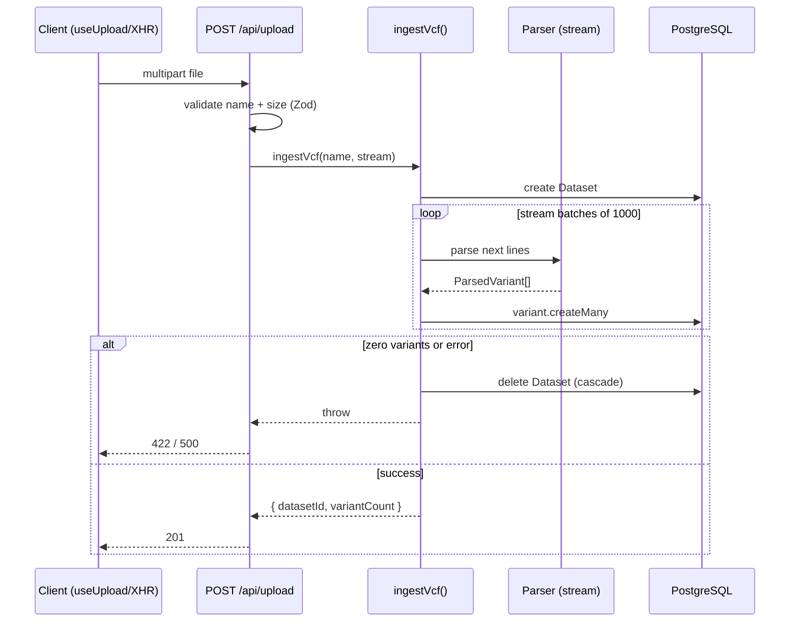

# API design

_Internal engineering documentation — Genome Variant Explorer._

The API is a small REST surface implemented with Next.js Route Handlers on the
Node runtime. It is JSON-only, unversioned (internal), and stateless.

## 1. Conventions

- **Base path:** `/api`.
- **Content type:** `application/json` for responses; upload is
  `multipart/form-data`.
- **Success envelope:** resources are returned directly; list endpoints use a
  `Paginated<T>` envelope (below).
- **Error envelope:** `{ "error": string, "details"?: unknown }`.
- **Validation:** query strings are parsed through Zod schemas that coerce types
  and clamp bounds. Invalid params never reach the database.
- **Caching:** all routes set `dynamic = "force-dynamic"` and `runtime =
  "nodejs"`; responses reflect live data.

### Pagination envelope

```jsonc
{
  "data": [ /* T[] */ ],
  "page": 1,
  "pageSize": 25,
  "total": 1234,
  "totalPages": 50
}
```

`page` is 1-based. `pageSize` is clamped to `1..100` (default 25 for variants,
10 for datasets). Out-of-range or non-numeric values fall back to defaults
rather than erroring (`.catch()` in the Zod schema).

## 2. Endpoints

| Method | Path                    | Description                                  |
| ------ | ----------------------- | -------------------------------------------- |
| GET    | `/api/dashboard`        | Aggregate stats for the landing page.        |
| POST   | `/api/upload`           | Upload + parse a VCF file.                   |
| GET    | `/api/datasets`         | Paginated list of datasets.                  |
| GET    | `/api/datasets/:id`     | One dataset with statistics.                 |
| GET    | `/api/variants`         | Paginated, filtered, sorted variants.        |
| GET    | `/api/variants/:id`     | One variant.                                 |
| GET    | `/api/variants/filters` | Distinct facet values for the filter UI.     |

### GET `/api/dashboard`

Returns `DashboardStats`:

```jsonc
{
  "totalDatasets": 3,
  "totalVariants": 4200,
  "topGenes": [{ "gene": "BRCA1", "count": 120 }],
  "classifications": [{ "classification": "Pathogenic", "count": 88 }],
  "recentDatasets": [
    { "id": "…", "filename": "sample.vcf", "uploadDate": "2026-01-01T…Z", "variantCount": 14 }
  ]
}
```

### POST `/api/upload`

Request: `multipart/form-data` with a single `file` field.

Validation:

- The `file` field must be present and a `File`.
- Filename must end in `.vcf` / `.vcf.txt`; size must be > 0.
- After parsing, the file must yield ≥ 1 variant.

Responses:

| Status | Meaning                                                       |
| ------ | ------------------------------------------------------------ |
| 201    | `{ "datasetId": string, "variantCount": number }`            |
| 400    | Missing file, wrong extension, or empty file.                |
| 422    | Parsed successfully but contained no variants (`EmptyVcf`).  |
| 500    | Unexpected server/parse error (dataset rolled back).         |



> The client uses `XMLHttpRequest` (not `fetch`) to observe upload progress via
> `upload.onprogress`.

### GET `/api/datasets`

Query params: `page`, `pageSize`. Returns `Paginated<DatasetDTO>` ordered by
`uploadDate desc`. Each item includes `variantCount`.

### GET `/api/datasets/:id`

Returns `DatasetStats` (dataset fields + `topGenes`, `classifications`,
`chromosomeCount`) or `404`.

### GET `/api/variants`

Query params:

| Param                  | Type   | Notes                                                        |
| ---------------------- | ------ | ------------------------------------------------------------ |
| `page`, `pageSize`     | int    | Pagination (pageSize ≤ 100).                                 |
| `search`               | string | Case-insensitive match on gene, chromosome, ref, alt.        |
| `chromosome`           | string | Exact match.                                                 |
| `gene`                 | string | Case-insensitive `contains`.                                 |
| `clinicalSignificance` | string | Exact match.                                                 |
| `datasetId`            | string | Scope to one dataset.                                        |
| `sortBy`               | enum   | `chromosome \| position \| gene \| quality \| clinicalSignificance`. |
| `sortOrder`            | enum   | `asc \| desc`.                                               |

Returns `Paginated<VariantDTO>`. A stable secondary sort on `position` is
applied when the primary sort field is not `position`.

### GET `/api/variants/:id`

Returns a single `VariantDTO` (including the raw `info` string) or `404`.

### GET `/api/variants/filters`

Returns distinct facet values used to populate the filter dropdowns:

```jsonc
{ "chromosomes": ["1", "7", "13", "17", "X"], "clinicalSignificances": ["Benign", "Pathogenic"] }
```

## 3. Status code summary

| Code | When                                             |
| ---- | ------------------------------------------------ |
| 200  | Successful read.                                 |
| 201  | Upload created a dataset.                        |
| 400  | Invalid params or malformed request.             |
| 404  | Resource not found.                              |
| 422  | Semantically invalid upload (no variants).       |
| 500  | Unhandled server error.                          |

## 4. Extensibility notes

- The API is unversioned because it is internal and consumed only by this
  frontend. If externalised, introduce `/api/v1`.
- DTOs (`types/index.ts`) are decoupled from Prisma models so the DB can evolve
  without breaking the contract.
- New filters are added by extending `variantQuerySchema` and `buildWhere()` —
  the route handler needs no change.
