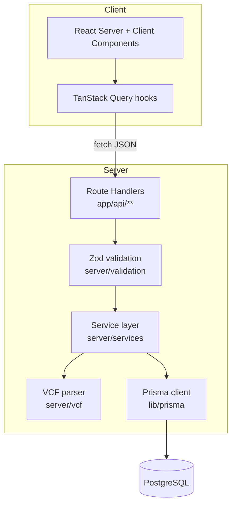
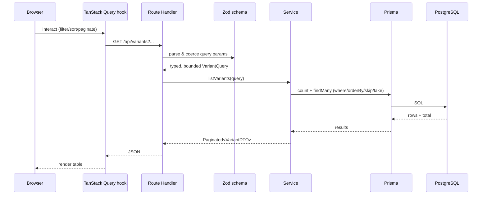

# Architecture

_Internal engineering documentation — Genome Variant Explorer._

## 1. Purpose

Genome Variant Explorer is an internal platform that lets researchers upload VCF
files, have them parsed into structured variant records, and then search,
filter, and inspect those variants. This document describes the system's
structure, the responsibilities of each layer, and the reasoning behind the
boundaries.

## 2. Design principles

1. **Thin API, fat services.** Route handlers only validate input and shape
   responses. All domain logic lives in `server/services/*`, which is the only
   code permitted to touch Prisma.
2. **UI never talks to the database.** Client components fetch through the REST
   API via typed hooks. This keeps the database schema free to change behind a
   stable API contract.
3. **Stream, don't buffer.** VCF files can be large. Parsing is built on Web
   Streams and batched inserts so memory stays flat.
4. **Validate at the edge.** Every external input (query params, uploads) is run
   through a Zod schema before it reaches business logic.
5. **Fail safe.** A failed or empty upload rolls back its dataset so the system
   never persists partial or junk data.

## 3. Layered view

### Layer responsibilities

| Layer          | Location             | Responsibility                                             | May depend on            |
| -------------- | -------------------- | ---------------------------------------------------------- | ------------------------ |
| UI             | `app/**`, `components/**` | Rendering, interaction, client state                   | hooks, types, utils      |
| Data hooks     | `hooks/**`           | Server-state fetching/caching (TanStack Query)             | api-client, types        |
| API            | `app/api/**`         | HTTP contract, status codes, response shaping              | validation, services     |
| Validation     | `server/validation`  | Parse & coerce untrusted input (Zod)                       | types                    |
| Services       | `server/services`    | Domain logic, query composition, aggregation               | prisma, parser, types    |
| Parser         | `server/vcf`         | Turn VCF bytes into `ParsedVariant[]`                      | types                    |
| Persistence    | `lib/prisma`, `prisma/schema.prisma` | Database access + schema                    | —                        |

Dependencies point **downward** only. The UI cannot import a service; a service
cannot import a component.

## 4. Key modules

- **`lib/prisma.ts`** — a singleton PrismaClient cached on `globalThis` to avoid
  exhausting connections during dev hot-reload.
- **`lib/api.ts`** — `ok()` / `error()` / `handle()` helpers that give every
  route uniform JSON and centralised error mapping (Zod → 400, unknown → 500).
- **`lib/api-client.ts`** — the client fetch wrapper (query serialisation, error
  unwrapping) used by all hooks.
- **`server/vcf/parser.ts`** — the streaming parser (see
  [upload pipeline](#6-upload-pipeline)).
- **`server/services/*`** — `variant-service`, `dataset-service`,
  `dashboard-service`, `ingest-service`.

## 5. Request flow (read path)

## 6. Upload pipeline

```mermaid
flowchart LR
    A[Drag & drop VCF] --> B[POST /api/upload<br/>multipart form]
    B --> C{Validate file<br/>name + size}
    C -- invalid --> E1[400 / 422]
    C -- valid --> D[Create Dataset row]
    D --> F[Stream file.stream&#40;&#41;]
    F --> G[streamLines&#40;&#41;<br/>decode + split]
    G --> H[parseVariantLines&#40;&#41;<br/>skip ##, read header]
    H --> I[Batch of 1000]
    I --> J[prisma.variant.createMany]
    J --> H
    H --> K{variantCount > 0?}
    K -- no --> L[Delete dataset<br/>throw EmptyVcfError → 422]
    K -- yes --> M[201 &#123; datasetId, variantCount &#125;]
    M --> N[Redirect to /datasets/:id]
```

The parser yields variants lazily; ingestion accumulates them into batches of
1,000 and flushes with `createMany`. If parsing throws or yields zero variants,
the dataset (and any inserted rows, via cascade) is removed.

## 7. Error handling

- **Validation errors** (`ZodError`) → `400` with a flattened field map.
- **Not found** → `404` from the service returning `null`.
- **Empty/invalid VCF** → `422` (`EmptyVcfError`).
- **Unexpected** → `500`, logged server-side, generic message to the client.

On the client, hooks surface `isError`; pages render an `ErrorState` with a
retry, and mutations raise Sonner toasts.

## 8. Performance considerations

- Streaming parse + batched inserts keep upload memory and DB round-trips
  bounded regardless of file size.
- List endpoints run `count` and `findMany` concurrently with `Promise.all`.
- Dashboard aggregations run all independent queries concurrently.
- Indexes back every filter/sort column (see database-design.md).
- TanStack Query caches reads and uses `keepPreviousData` to avoid UI flicker
  while paging.

## 9. Known trade-offs & future work

- Ingestion runs within the request lifecycle. Very large files would be better
  served by a background worker with a job record. See README "Future
  improvements".
- Search uses `ILIKE`; a trigram/full-text index would scale fuzzy search
  further.
- Pagination is offset-based; keyset pagination would improve deep-page latency.
