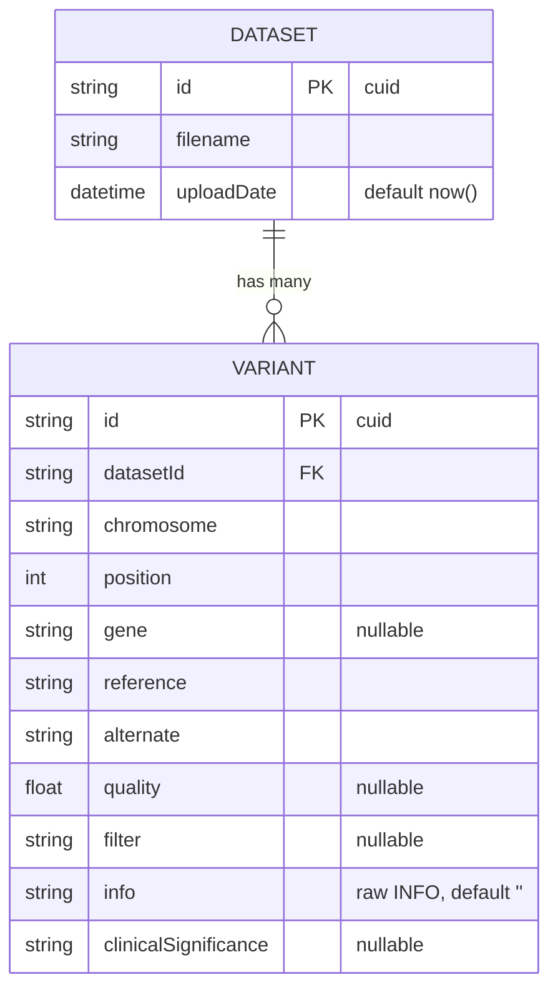

# Database design

_Internal engineering documentation — Genome Variant Explorer._

The system uses PostgreSQL through Prisma. The schema is deliberately small: one
file (`Dataset`) has many records (`Variant`).

## 1. Entity relationship



## 2. Tables

### `datasets`

| Column       | Type        | Notes                          |
| ------------ | ----------- | ------------------------------ |
| `id`         | text (cuid) | Primary key.                   |
| `filename`   | text        | Original uploaded filename.    |
| `uploadDate` | timestamp   | Defaults to insertion time.    |

Index: `uploadDate` — the dashboard and dataset list order by it descending.

### `variants`

| Column                 | Type        | Nullable | Notes                                   |
| ---------------------- | ----------- | -------- | --------------------------------------- |
| `id`                   | text (cuid) | no       | Primary key.                            |
| `datasetId`            | text        | no       | FK → `datasets.id`, `ON DELETE CASCADE`. |
| `chromosome`           | text        | no       | VCF `CHROM`.                            |
| `position`             | integer     | no       | VCF `POS`.                              |
| `gene`                 | text        | yes      | Extracted from INFO.                    |
| `reference`            | text        | no       | VCF `REF`.                              |
| `alternate`            | text        | no       | VCF `ALT`.                              |
| `quality`              | double      | yes      | VCF `QUAL` (`.` → null).                |
| `filter`               | text        | yes      | VCF `FILTER`.                           |
| `info`                 | text        | no       | Raw INFO string (default `''`).         |
| `clinicalSignificance` | text        | yes      | Extracted from `CLNSIG`.                |

## 3. Indexing strategy

Indexes are placed on exactly the columns the application filters and sorts by,
so the common access patterns stay index-backed rather than doing sequential
scans:

| Index                          | Serves                                             |
| ------------------------------ | -------------------------------------------------- |
| `variants(datasetId)`          | Dataset-scoped queries, cascade deletes, `_count`. |
| `variants(gene)`               | Gene filter, top-genes aggregation.                |
| `variants(chromosome)`         | Chromosome facet filter and sort.                  |
| `variants(position)`           | Position sort (primary + stable secondary).        |
| `variants(clinicalSignificance)` | Classification facet + aggregation.              |
| `datasets(uploadDate)`         | Recent/most-recent ordering.                       |

Trade-off: indexes speed reads but add write cost. Because ingestion is a
bulk-insert workload, we keep the index set to the columns that are actually
queried and avoid over-indexing (e.g. no index on `reference`/`alternate`,
which are only touched by broad text search).

## 4. Data types & nullability rationale

- `gene`, `quality`, `filter`, `clinicalSignificance` are **nullable** because
  a valid VCF record may legitimately omit them (`.` sentinel). The parser maps
  the VCF missing-value sentinel to SQL `NULL`.
- `info` is **not null** with a default of `''`; the raw INFO string is always
  stored so no source data is lost, even when structured extraction fails.
- `position` is a 32-bit `Int`. Human chromosome coordinates fit comfortably; if
  targeting organisms with larger contigs, widen to `BigInt`.
- IDs are `cuid` — collision-resistant, URL-safe, and generated app-side so no
  round-trip is needed to learn a new row's id.

## 5. Referential integrity

`Variant.dataset` is declared with `onDelete: Cascade`. Deleting a dataset (for
example, when an upload fails validation) removes all of its variants in one
statement, which is what the ingestion rollback relies on.

## 6. Aggregations

Statistics are computed with Prisma `groupBy`/`count` rather than materialised
tables:

- **Top genes:** `groupBy(gene)` where `gene IS NOT NULL`, ordered by count,
  limited to 10.
- **Classifications:** `groupBy(clinicalSignificance)` where not null.
- **Totals:** `count()` on each table.

These run against the indexed columns and are cheap at the expected data scale.
If datasets grow to tens of millions of variants, precomputed rollup tables (or
a materialised view refreshed after ingestion) would be the next step.

## 7. Migrations

Schema changes are managed by Prisma Migrate:

```bash
npm run prisma:migrate   # dev: create + apply a migration
npm run prisma:deploy    # prod: apply committed migrations
```

`DIRECT_URL` may be set when running behind a connection pooler (PgBouncer,
Neon, Supabase) so migrations use a direct connection while the app uses the
pool.
